# React Native Animation 학습

## 학습 목표

React Native에서 제공하는 다양한 애니메이션 기법을 학습하고 실무에 적용할 수 있는 능력을 기릅니다.

---

## 📖 목차

1. [Animated 심화 실습](#1-animated-심화-실습)
2. [PanResponder를 활용한 제스처 인식](#2-panresponder를-활용한-제스처-인식)
3. [유튜브 뮤직 클론](#3-유튜브-뮤직-클론)
4. [모바일페이 클론코딩](#4-모바일페이-클론코딩)

---

## 1. Animated 심화 실습

React Native의 `Animated` API를 활용하여 다양한 UI 컴포넌트를 구현하는 실습입니다.

### 1.1 Snackbar 만들기

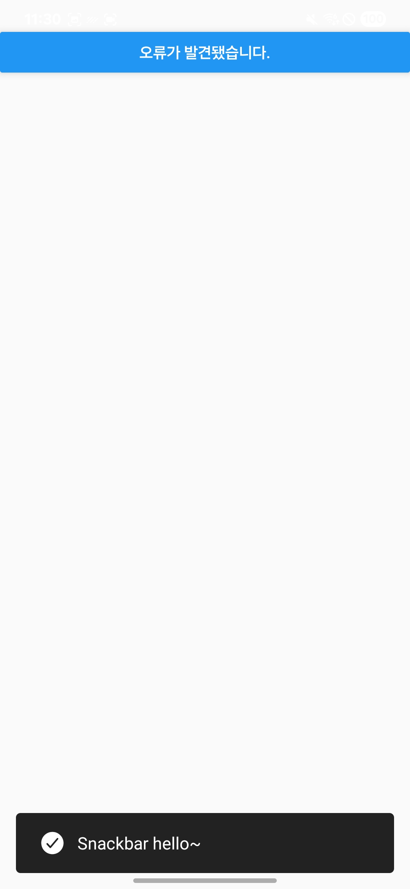

#### 📝 설명

하단에서 올라오는 알림 메시지(Snackbar)를 구현합니다. 버튼을 클릭하면 애니메이션과 함께 Snackbar가 나타났다가 2초 후 자동으로 사라집니다.

#### 🎯 주요 학습 내용

- `Animated.sequence`: 여러 애니메이션을 순차적으로 실행
- `Animated.delay`: 애니메이션 사이에 지연 시간 추가
- `translateY` 변환을 활용한 슬라이드 애니메이션
- `Easing` 함수로 자연스러운 움직임 구현

#### 💻 핵심 코드

```tsx
// src/chapter3/Snackbar.tsx
const translateYAnim = useRef(new Animated.Value(100)).current;

const onPressButton = () => {
  Animated.sequence([
    // 1. 위로 올라오기
    Animated.timing(translateYAnim, {
      toValue: 0,
      useNativeDriver: true,
      easing: Easing.out(Easing.circle),
    }),
    // 2. 2초 대기
    Animated.delay(2000),
    // 3. 아래로 내려가기
    Animated.timing(translateYAnim, {
      toValue: 100,
      useNativeDriver: true,
      easing: Easing.in(Easing.circle),
    }),
  ]).start();
};
```

---

### 1.2 Drawer Menu 만들기

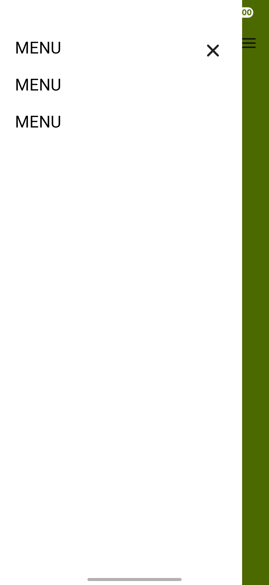

#### 📝 설명

왼쪽에서 슬라이드되어 나오는 Drawer 메뉴를 구현합니다. 메뉴 버튼을 누르면 메뉴가 나타나고, 배경 또는 닫기 버튼을 누르면 사라집니다.

#### 🎯 주요 학습 내용

- `translateX`를 활용한 가로 슬라이드 애니메이션
- `interpolate`로 여러 스타일 속성 동시 제어

#### 💻 핵심 코드

```tsx
// src/chapter3/DrawerMenu.tsx
const interpolateAnim = useRef(new Animated.Value(0)).current;
const width = Dimensions.get('window').width;

// 메뉴 슬라이드 애니메이션
<Animated.View
  style={[
    styles.menuContainer,
    {
      transform: [
        {
          translateX: interpolateAnim.interpolate({
            inputRange: [0, 1],
            outputRange: [width * -0.9, 0], // 화면 왼쪽 밖에서 안으로
          }),
        },
      ],
    },
  ]}
>
  {/* 메뉴 내용 */}
</Animated.View>

// 배경 어둡게 처리
<Animated.View
  style={[
    styles.backdrop,
    {
      width: interpolateAnim.interpolate({
        inputRange: [0, 1],
        outputRange: ['0%', '2000%'],
      }),
      backgroundColor: interpolateAnim.interpolate({
        inputRange: [0, 1],
        outputRange: ['#00000000', '#00000090'], // 투명 → 반투명
      }),
    },
  ]}
/>
```

---

### 1.3 Collapse 만들기

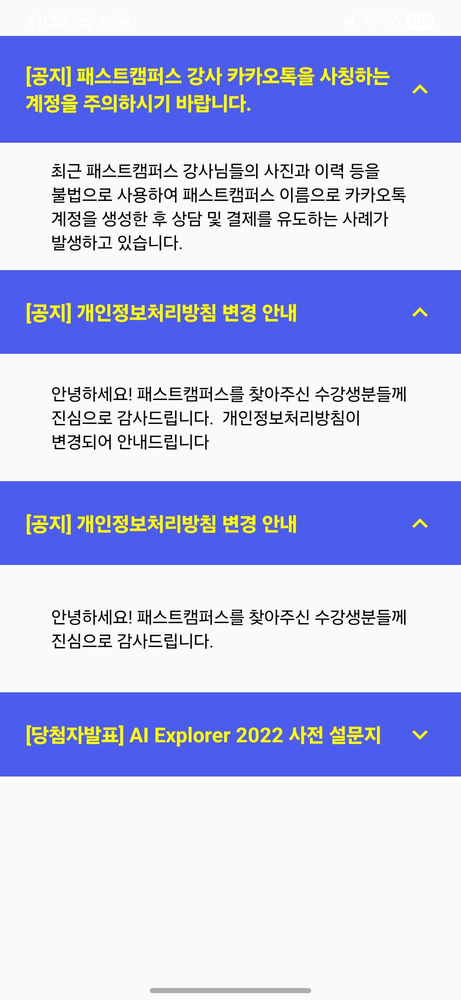

#### 📝 설명

FAQ 형태의 접을 수 있는 아코디언 UI를 구현합니다. 질문을 클릭하면 답변이 펼쳐지고, 다시 클릭하면 접힙니다.

#### 🎯 주요 학습 내용

- 동적 `height` 애니메이션
- `rotate` 변환으로 아이콘 회전 효과
- 토글 상태 관리와 애니메이션 연동
- 여러 아이템을 독립적으로 애니메이션 처리

#### 💻 핵심 코드

```tsx
// src/chapter3/Collapse.tsx
const interpolateAnim = useRef(new Animated.Value(0)).current;
let isOpened = false;

const onPress = () => {
  Animated.timing(interpolateAnim, {
    toValue: isOpened ? 0 : 1,
    duration: 200,
    useNativeDriver: false, // height는 native driver 미지원
  }).start(() => {
    isOpened = !isOpened;
  });
};

// 답변 영역 높이 애니메이션
<Animated.View
  style={[
    styles.answer,
    {
      height: interpolateAnim.interpolate({
        inputRange: [0, 1],
        outputRange: [0, 100], // 0 → 100px
      }),
    },
  ]}
>
  <Text>{item.a}</Text>
</Animated.View>

// 화살표 아이콘 회전
<Animated.View
  style={{
    transform: [
      {
        rotate: interpolateAnim.interpolate({
          inputRange: [0, 1],
          outputRange: ['0deg', '180deg'], // 0도 → 180도
        }),
      },
    ],
  }}
>
  <MaterialIcons name="expand-more" />
</Animated.View>
```

---

### 1.4 Progress Bar 만들기

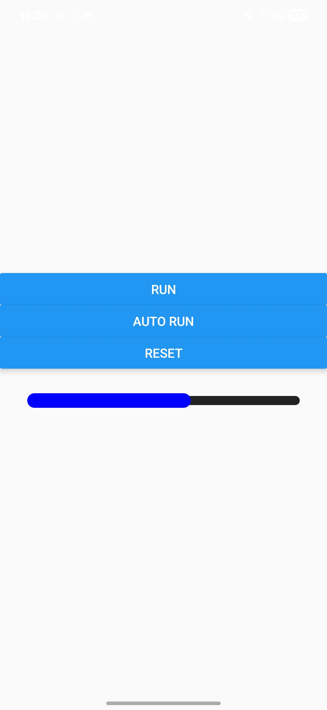

#### 📝 설명

진행 상황을 시각적으로 표시하는 Progress Bar를 구현합니다. 수동으로 단계별로 진행하거나, 자동으로 진행시킬 수 있습니다.

#### 🎯 주요 학습 내용

- `width` 애니메이션으로 진행률 표현
- `Animated.spring`을 활용한 탄성 효과
- `Animated.sequence`로 단계별 진행 구현
- `interpolate`로 퍼센트 값 변환

#### 💻 핵심 코드

```tsx
// src/chapter3/ProgressBar.tsx
const interpolateAnim = useRef(new Animated.Value(0)).current;
const clickCount = useRef(1);

// 수동 진행 (20%씩)
const onPressRun = () => {
  if (clickCount.current > 5) return;

  const targetValue = 20 * clickCount.current;
  Animated.spring(interpolateAnim, {
    toValue: targetValue,
    friction: 7, // 마찰력 (값이 클수록 빨리 멈춤)
    tension: 40, // 장력 (값이 클수록 빠르게 움직임)
    useNativeDriver: false,
  }).start();
  clickCount.current++;
};

// 자동 진행 (20% → 70% → 100%)
const onPressAutoRun = () => {
  Animated.sequence([
    Animated.spring(interpolateAnim, {
      toValue: 20,
      friction: 7,
      tension: 40,
      useNativeDriver: false,
    }),
    Animated.spring(interpolateAnim, {
      toValue: 70,
      friction: 7,
      tension: 40,
      useNativeDriver: false,
    }),
    Animated.spring(interpolateAnim, {
      toValue: 100,
      friction: 7,
      tension: 40,
      useNativeDriver: false,
    }),
  ]).start();
};

// Progress Bar UI
<Animated.View
  style={[
    styles.progressBarMoving,
    {
      width: interpolateAnim.interpolate({
        inputRange: [0, 100],
        outputRange: ['0%', '100%'], // 0~100 값을 퍼센트로 변환
      }),
    },
  ]}
/>;
```

---

### 1.5 Skeleton 로딩 UI 만들기

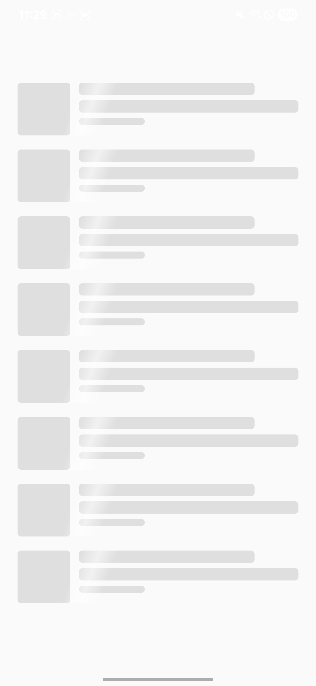

#### 📝 설명

콘텐츠 로딩 중 표시되는 Skeleton UI를 구현합니다. 빛나는 효과가 좌측에서 우측으로 반복적으로 이동합니다.

#### 🎯 주요 학습 내용

- `Animated.loop`로 무한 반복 애니메이션
- `LinearGradient`와 애니메이션 결합
- `translateX`를 활용한 가로 이동 효과
- `Dimensions`로 화면 너비 기반 애니메이션

#### 💻 핵심 코드

```tsx
// src/chapter3/Skeleton.tsx
const interpolateAnim = useRef(new Animated.Value(0)).current;
const windowWidth = Dimensions.get('window').width;

useEffect(() => {
  Animated.loop(
    Animated.timing(interpolateAnim, {
      toValue: 1,
      useNativeDriver: true,
      duration: 1000,
    }),
  ).start();
}, []);

// 빛나는 효과
<Animated.View
  style={{
    position: 'absolute',
    top: -30,
    transform: [
      {
        translateX: interpolateAnim.interpolate({
          inputRange: [0, 1],
          outputRange: [-windowWidth * 0.2, windowWidth * 1.3], // 좌측 밖 → 우측 밖
        }),
      },
      { rotate: '20deg' },
    ],
  }}
>
  <LinearGradient
    start={{ x: 0, y: 0 }}
    end={{ x: 1, y: 0 }}
    colors={['#ffffff00', '#ffffff90', '#ffffff00']} // 투명 → 흰색 → 투명
  >
    <View style={{ width: 40, height: 100 }} />
  </LinearGradient>
</Animated.View>;
```

---

### 1.6 눈 내리는 배경 만들기

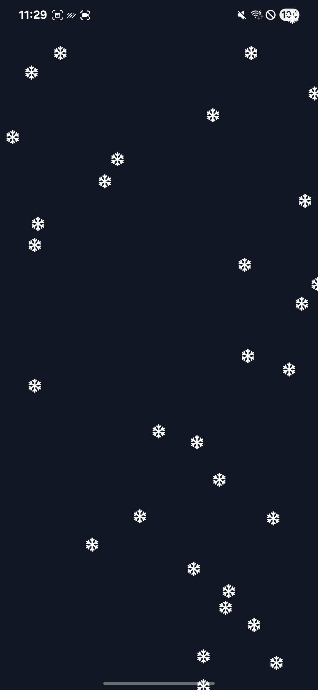

#### 📝 설명

겨울 느낌의 눈이 내리는 배경 애니메이션을 구현합니다. 50개의 눈송이가 랜덤한 위치에서 각각 다른 타이밍으로 떨어집니다.

#### 🎯 주요 학습 내용

- 다수의 독립적인 애니메이션 동시 실행
- `delay`를 활용한 시간차 애니메이션
- `Math.random()`으로 랜덤 위치 생성
- Icon 컴포넌트와 애니메이션 결합

#### 💻 핵심 코드

```tsx
// src/chapter3/SnowAnimation.tsx
<View style={{ backgroundColor: '#121723', flex: 1 }}>
  {Array.from({ length: 50 }).map((_, index) => {
    const interpolateAnim = useRef(new Animated.Value(0)).current;

    useEffect(() => {
      Animated.loop(
        Animated.timing(interpolateAnim, {
          toValue: 1,
          duration: 5000,
          delay: index * 100, // 각 눈송이마다 100ms씩 딜레이
          useNativeDriver: false,
        }),
      ).start();
    });

    return (
      <Animated.View
        key={index}
        style={{
          position: 'absolute',
          left: `${Math.floor(Math.random() * 100)}%`, // 랜덤 가로 위치
          top: interpolateAnim.interpolate({
            inputRange: [0, 1],
            outputRange: ['-10%', '110%'], // 화면 위 → 아래
          }),
        }}
      >
        <Icon name="snowflake" size={16} color="#fff" />
      </Animated.View>
    );
  })}
</View>
```

---

## 🎓 학습 요약

### Animated API 핵심 메서드

| 메서드              | 설명                      | 사용 예제                         |
| ------------------- | ------------------------- | --------------------------------- |
| `Animated.timing`   | 시간 기반 선형 애니메이션 | Snackbar, Skeleton, SnowAnimation |
| `Animated.spring`   | 물리 기반 탄성 애니메이션 | ProgressBar                       |
| `Animated.sequence` | 애니메이션 순차 실행      | Snackbar, ProgressBar             |
| `Animated.loop`     | 애니메이션 무한 반복      | Skeleton, SnowAnimation           |
| `Animated.delay`    | 지연 시간 추가            | Snackbar, SnowAnimation           |

### interpolate 활용

`interpolate`는 하나의 Animated.Value를 다양한 범위로 변환할 때 사용합니다.

```tsx
// 숫자 변환
width: animValue.interpolate({
  inputRange: [0, 100],
  outputRange: [0, 300],
});

// 퍼센트 변환
width: animValue.interpolate({
  inputRange: [0, 100],
  outputRange: ['0%', '100%'],
});

// 색상 변환
backgroundColor: animValue.interpolate({
  inputRange: [0, 1],
  outputRange: ['#ffffff', '#000000'],
});

// 각도 변환
rotate: animValue.interpolate({
  inputRange: [0, 1],
  outputRange: ['0deg', '180deg'],
});
```

### useNativeDriver 사용 가이드

**사용 가능한 속성 (useNativeDriver: true)**

- ✅ `opacity`
- ✅ `transform` 계열
  - `translateX`, `translateY`
  - `scale`, `scaleX`, `scaleY`
  - `rotate`, `rotateX`, `rotateY`, `rotateZ`

**사용 불가능한 속성 (useNativeDriver: false 필요)**

- ❌ `width`, `height`
- ❌ `left`, `right`, `top`, `bottom`
- ❌ `backgroundColor` (일부 플랫폼)
- ❌ `padding`, `margin`

### 성능 최적화 팁

1. 가능한 경우 항상 `useNativeDriver: true` 사용
2. 레이아웃 속성(width, height) 대신 `transform` 사용
3. 많은 수의 애니메이션은 `useNativeDriver`로 최적화 필수

---

## 2. PanResponder를 활용한 제스처 인식

React Native의 `PanResponder` API를 활용하여 사용자의 터치 제스처를 감지하고 인터랙티브한 UI를 구현하는 실습입니다.

### 2.1 공 던지기 애니메이션

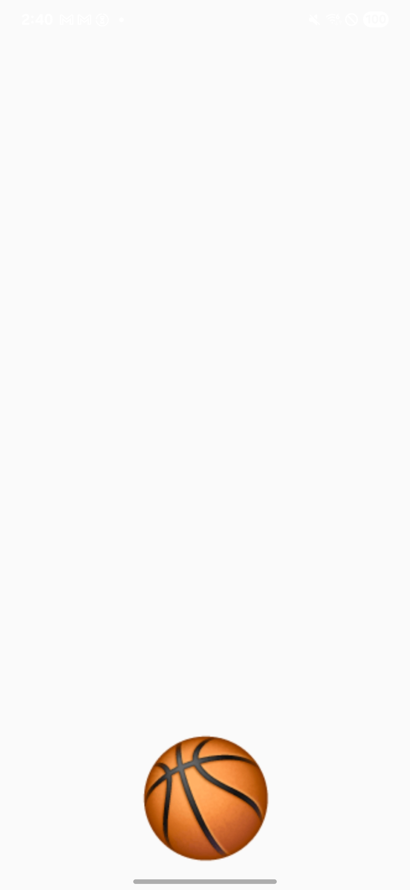

#### 📝 설명

농구공을 드래그하여 던지는 애니메이션을 구현합니다. 공을 터치하여 드래그하면 따라 움직이고, 놓으면 관성에 따라 날아가다가 1.5초 후 원래 위치로 돌아옵니다.

#### 🎯 주요 학습 내용

- `PanResponder` 기본 사용법
- `Animated.ValueXY`로 2D 좌표 애니메이션
- `Animated.event`를 활용한 제스처 추적
- `Animated.decay`로 감속 효과 구현
- `gestureState.vx`, `gestureState.vy`로 속도 기반 물리 효과

#### 💻 핵심 코드

```tsx
// src/chapter6/PanResponderBall.tsx
const panAnim = useRef(new Animated.ValueXY({ x: 0, y: 0 })).current;

const panResponder = PanResponder.create({
  onMoveShouldSetPanResponder: () => true,
  
  // 터치 중(드래그)일 때 공 이동
  onPanResponderMove: Animated.event(
    [
      null,
      {
        dx: panAnim.x,
        dy: panAnim.y,
      },
    ],
    { useNativeDriver: false },
  ),
  
  // 터치 종료(드래그 종료)일 때 공 이동 및 감속
  onPanResponderEnd(e, gestureState) {
    Animated.decay(panAnim, {
      velocity: { x: gestureState.vx, y: gestureState.vy },
      deceleration: 0.997, // 감속 비율 (1에 가까울수록 천천히 멈춤)
      useNativeDriver: true,
    }).start();
  },
  
  // 1.5초 후 공이 제자리로 돌아오도록
  onPanResponderRelease(e, gestureState) {
    setTimeout(() => {
      panAnim.setValue({ x: 0, y: 50 });
      Animated.spring(panAnim, {
        toValue: { x: 0, y: 0 },
        useNativeDriver: true,
      }).start();
    }, 1500);
  },
});

// 공 UI
<Animated.View
  {...panResponder.panHandlers}
  style={{
    position: 'absolute',
    bottom: 20,
    transform: [{ translateX: panAnim.x }, { translateY: panAnim.y }],
  }}
>
  <Text style={{ fontSize: 100 }}>🏀</Text>
</Animated.View>
```

---

### 2.2 하단 모달 (Bottom Sheet)

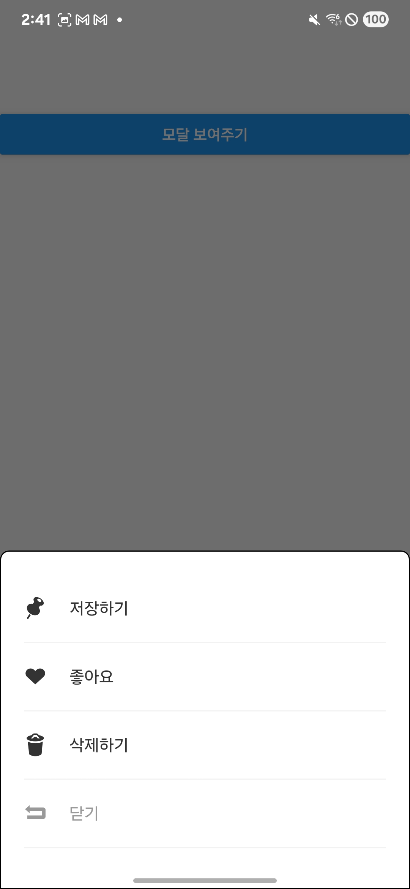

#### 📝 설명

하단에서 올라오는 모달(Bottom Sheet)을 구현합니다. 버튼을 누르면 모달이 나타나고, 배경을 터치하거나 모달을 아래로 드래그하면 사라집니다.

#### 🎯 주요 학습 내용

- 드래그 방향 감지 (`gestureState.dy`)
- 조건부 제스처 처리 (일정 거리 이상 드래그 시)
- 배경 투명도 애니메이션과 모달 위치 동시 제어
- `useSafeAreaInsets`로 안전 영역 대응

#### 💻 핵심 코드

```tsx
// src/chapter6/PanResponderModal.tsx
const interpolateAnim = useRef(new Animated.Value(0)).current;
const [show, setShow] = useState(false);

const panResponder = PanResponder.create({
  onStartShouldSetPanResponder: () => true,
  onPanResponderMove: (event, gestureState) => {
    // 아래로 100px 이상 드래그 시 모달 닫기
    if (gestureState.dy > 100) {
      hideMode();
    }
  },
});

const showMode = () => {
  setShow(true);
  Animated.timing(interpolateAnim, {
    toValue: 1,
    duration: 300,
    useNativeDriver: false,
  }).start();
};

const hideMode = () => {
  Animated.timing(interpolateAnim, {
    toValue: 0,
    duration: 300,
    useNativeDriver: false,
  }).start(() => {
    setShow(false); // 애니메이션 완료 후 unmount
  });
};

// 배경 어둡게 처리
{show && (
  <Animated.View
    style={{
      position: 'absolute',
      width: '100%',
      height: '100%',
      backgroundColor: '#00000090',
      opacity: interpolateAnim, // 0 → 1
    }}
  />
)}

// 모달 컨텐츠
<Animated.View
  {...panResponder.panHandlers}
  style={{
    position: 'absolute',
    bottom: interpolateAnim.interpolate({
      inputRange: [0, 1],
      outputRange: [-500, 0], // 화면 아래 → 화면 하단
    }),
    backgroundColor: 'white',
    width: '100%',
    borderTopLeftRadius: 8,
    borderTopRightRadius: 8,
  }}
>
  {/* 모달 내용 */}
</Animated.View>
```

---

### 2.3 배너 슬라이더 (Banner Slider)

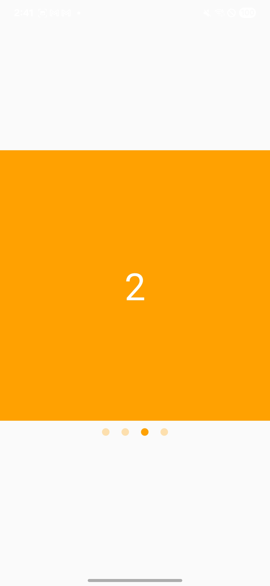

#### 📝 설명

좌우 스와이프로 넘어가는 배너 슬라이더를 구현합니다. 배너를 좌우로 드래그하거나 하단의 인디케이터를 클릭하여 페이지를 이동할 수 있습니다.

#### 🎯 주요 학습 내용

- 좌우 드래그 방향 감지 (`gestureState.dx`)
- 임계값 기반 페이지 전환 (80px 이상 드래그)
- 중복 실행 방지를 위한 `pending` 상태 관리
- 화면 너비 기반 슬라이드 애니메이션

#### 💻 핵심 코드

```tsx
// src/chapter6/PanResponderBannerSlider.tsx
const [focus, setFocus] = useState(0);
const bannerAnim = useRef(new Animated.Value(0)).current;
const pendingRef = useRef(true); // 애니메이션 중복 실행 방지

const { width } = Dimensions.get('window');

const panResponder = PanResponder.create({
  onMoveShouldSetPanResponder: () => true,
  onPanResponderMove: (event, gestureState) => {
    const toRight = gestureState.dx < -80; // 왼쪽으로 80px 이상 드래그
    const toLeft = gestureState.dx > 80;   // 오른쪽으로 80px 이상 드래그
    
    // 오른쪽 페이지로 이동
    if (toRight && pendingRef.current && focus < 3) {
      pendingRef.current = false;
      setFocus(focus + 1);
      Animated.timing(bannerAnim, {
        toValue: -(focus + 1) * width, // 다음 페이지 위치
        duration: 300,
        useNativeDriver: true,
      }).start(() => (pendingRef.current = true));
    } 
    // 왼쪽 페이지로 이동
    else if (toLeft && pendingRef.current && focus > 0) {
      setFocus(focus - 1);
      Animated.timing(bannerAnim, {
        toValue: -(focus - 1) * width, // 이전 페이지 위치
        duration: 300,
        useNativeDriver: true,
      }).start(() => (pendingRef.current = true));
    }
  },
});

// 배너 슬라이더 UI
<Animated.View
  {...panResponder.panHandlers}
  style={{
    flexDirection: 'row',
    transform: [{ translateX: bannerAnim }],
  }}
>
  {repeat(4, index => (
    <View key={index} style={{ width, height: width }}>
      <Text>{index}</Text>
    </View>
  ))}
</Animated.View>
```

---

### 2.4 폰트 크기 슬라이더 (Font Size Slider)

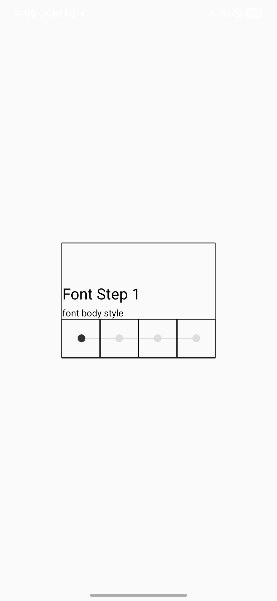

#### 📝 설명

드래그하여 폰트 크기를 조절하는 커스텀 슬라이더를 구현합니다. 슬라이더를 좌우로 드래그하거나 특정 위치를 클릭하여 폰트 크기를 변경할 수 있습니다.

#### 🎯 주요 학습 내용

- 드래그 중 실시간 위치 업데이트
- 드래그 종료 시 가장 가까운 단계로 스냅
- `Math.round`로 단계 계산
- 클릭과 드래그 동시 지원

#### 💻 핵심 코드

```tsx
// src/chapter6/PanResponderFontSlider.tsx
const BOX_SIZE = 50;
const CIRCLE_SIZE = 10;
const FONT = [
  { title: { fontSize: 20 }, body: { fontSize: 12 } },
  { title: { fontSize: 24 }, body: { fontSize: 14 } },
  { title: { fontSize: 30 }, body: { fontSize: 15 } },
  { title: { fontSize: 35 }, body: { fontSize: 19 } },
];

const circleAnim = useRef(new Animated.Value(0)).current;
const [step, setStep] = useState(0);

const panResponder = PanResponder.create({
  onMoveShouldSetPanResponder: () => true,
  onStartShouldSetPanResponder: () => true,
  
  // 드래그 시작: 현재 위치 저장
  onPanResponderStart: (event, gestureState) => {
    circleAnim.setValue(step * BOX_SIZE);
  },
  
  // 드래그 중: 실시간 위치 업데이트
  onPanResponderMove: (event, gestureState) => {
    circleAnim.setValue(gestureState.dx + step * BOX_SIZE);
  },
  
  // 드래그 종료: 가장 가까운 단계로 스냅
  onPanResponderEnd: (event, gestureState) => {
    const fontStep = step + Math.round(gestureState.dx / 50);
    const toValue = fontStep * BOX_SIZE;
    setStep(fontStep);
    
    Animated.spring(circleAnim, {
      toValue,
      friction: 7,
      tension: 50,
      useNativeDriver: true,
    }).start();
  },
});

// 슬라이더 UI
<Animated.View
  {...panResponder.panHandlers}
  style={{
    width: 10,
    height: 10,
    backgroundColor: '#333',
    borderRadius: 100,
    transform: [{ translateX: circleAnim }],
  }}
/>

// 폰트 적용
<Text style={FONT[step].title}>Font Step {step + 1}</Text>
<Text style={FONT[step].body}>font body style</Text>
```

---

## 🎓 PanResponder 학습 요약

### PanResponder 주요 이벤트

| 이벤트 | 설명 | 반환 값 |
| --- | --- | --- |
| `onStartShouldSetPanResponder` | 터치 시작 시 PanResponder를 활성화할지 결정 | boolean |
| `onMoveShouldSetPanResponder` | 터치 이동 시 PanResponder를 활성화할지 결정 | boolean |
| `onPanResponderStart` | 제스처가 시작될 때 호출 | void |
| `onPanResponderMove` | 터치가 이동할 때마다 호출 | void |
| `onPanResponderEnd` | 터치가 종료될 때 호출 (손가락을 뗌) | void |
| `onPanResponderRelease` | 제스처가 성공적으로 완료될 때 호출 | void |

---

## 3. 유튜브 뮤직 클론

`Animated` API와 `PanResponder`를 결합하여 실제 앱과 유사한 복잡한 인터랙션을 구현하는 프로젝트입니다.

| 메인 화면 | 스크롤 화면 | 플레이 화면 |
|:---:|:---:|:---:|
| 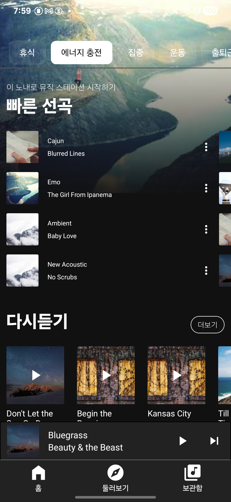 | 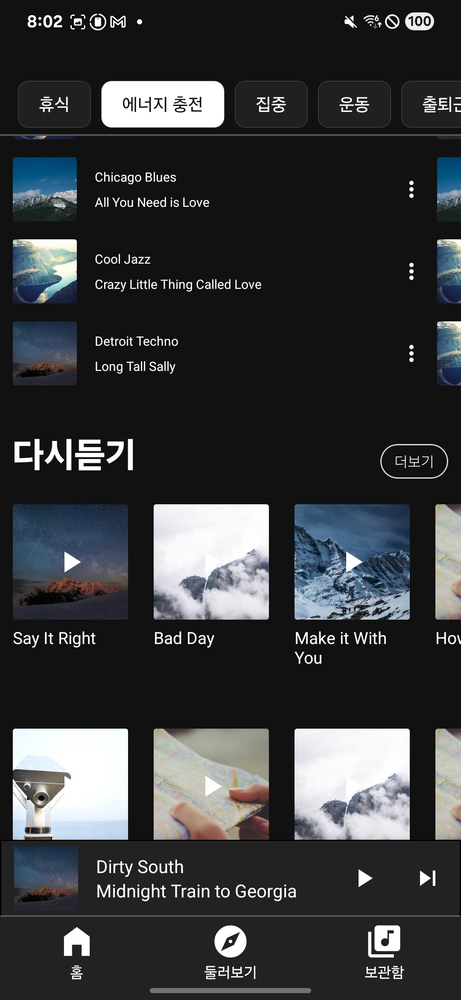 | 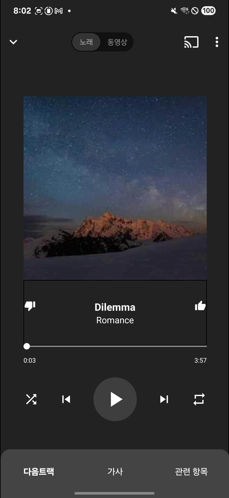 |

### 🔧 사용된 데이터 소스

이 프로젝트는 다음의 외부 라이브러리와 서비스를 활용하여 테스트 데이터를 생성합니다:

- **[@faker-js/faker](https://github.com/faker-js/faker)**: `faker.music.songName()` 메서드를 사용하여 랜덤한 음악 제목 생성
- **[Picsum Photos](https://picsum.photos/)**: `https://picsum.photos/300`을 통해 랜덤 이미지(앨범 커버) 제공


### 📝 설명

유튜브 뮤직 앱의 핵심 애니메이션 기능을 클론 코딩합니다. 스크롤에 반응하는 헤더, 드래그로 펼쳐지는 플레이어 등 실제 앱 수준의 복잡한 애니메이션을 구현합니다. 그 외 기능에 대한 구현은 없습니다.

### 🎯 주요 구현 기능

1. **스크롤 기반 헤더 애니메이션**
   - 아래로 스크롤 시 헤더가 위로 숨겨짐
   - 위로 스크롤 시 헤더가 다시 나타남
   - 스크롤 위치에 따라 헤더 배경 투명도 변경

2. **드래그 가능한 음악 플레이어**
   - Mini Player에서 Full Player로 드래그하여 확장
   - Full Player에서 아래로 드래그하여 축소
   - 드래그 진행도에 따라 UI 요소들이 유기적으로 변화

3. **반응형 하단 네비게이션**
   - 플레이어 확장 시 하단 네비게이션이 자연스럽게 숨겨짐
   - 플레이어 축소 시 다시 나타남

### 💻 핵심 코드

#### 1. 스크롤 기반 헤더 애니메이션


```tsx
// src/youtubeMusic/hooks/useYoutubeMusic.ts
const useYoutubeMusic = () => {
  const scrollStartRef = useRef(0);
  const headerAnim = useRef(new Animated.Value(0)).current;
  const showHeaderRef = useRef(true);

  const onScrollBeginDrag = (e: NativeSyntheticEvent<NativeScrollEvent>) => {
    const y = e.nativeEvent.contentOffset.y;
    scrollStartRef.current = y;
  };

  const onScroll = (e: NativeSyntheticEvent<NativeScrollEvent>) => {
    const y = e.nativeEvent.contentOffset.y;
    // dy: 스크롤 시작 위치로부터 현재까지 이동한 거리
    const dy = y - scrollStartRef.current;

    // dy > 0: 아래로 스크롤 (헤더를 숨겨야 함)
    // dy < 0: 위로 스크롤 (헤더를 보여야 함)

    // 위로 올라가는 헤더 (스크롤 다운)
    if (0 < dy && showHeaderRef.current) {
      headerAnim.setValue(dy);
    }
    // 아래로 내려가는 헤더 (스크롤 업)
    // -40: 너무 작은 움직임에는 반응하지 않도록 최소 임계값 설정
    //      사용자가 의도적으로 위로 스크롤할 때만 헤더가 나타나도록 함
    if (-40 < dy && dy < 0 && !showHeaderRef.current) {
      headerAnim.setValue(100 + dy);
    }
  };

  const onScrollEndDrag = (e: NativeSyntheticEvent<NativeScrollEvent>) => {
    const y = e.nativeEvent.contentOffset.y;
    const dy = y - scrollStartRef.current;

    // 위로 스크롤: 헤더 숨기기
    if (0 < dy && showHeaderRef.current) {
      Animated.spring(headerAnim, {
        toValue: 100,
        useNativeDriver: false,
      }).start();
      showHeaderRef.current = false;
    }
    // 아래로 스크롤: 헤더 보이기
    if (dy < 0 && !showHeaderRef.current) {
      Animated.spring(headerAnim, {
        toValue: 0,
        useNativeDriver: false,
      }).start();
      showHeaderRef.current = true;
    }
  };

  return { onScrollBeginDrag, onScroll, onScrollEndDrag, headerAnim };
};
```

```tsx
// src/youtubeMusic/components/header/LogoHeader.tsx
const LogoHeader = ({ headerAnim }: LogoHeaderProps) => {
  return (
    <Animated.View
      style={{
        marginTop: headerAnim.interpolate({
          // inputRange: [-40, 0, 100]
          // -40: 위로 스크롤 시 반응 시작 지점 (dy의 최소 임계값과 일치)
          // 0: 헤더가 완전히 보이는 기본 상태
          // 100: 헤더가 완전히 숨겨지는 상태 (onScrollEndDrag의 toValue와 일치)
          inputRange: [-40, 0, 100],
          // outputRange: [0, 0, -45]
          // -40~0 범위에서는 marginTop이 0으로 유지 (위로 스크롤 시 헤더 고정)
          // 0~100 범위에서는 0에서 -45로 변화 (아래로 스크롤 시 헤더가 위로 올라가며 숨김)
          outputRange: [0, 0, -45],
        }),
        opacity: headerAnim.interpolate({
          inputRange: [-40, 0, 20],
          outputRange: [1, 1, 0], // 0~20 범위에서 빠르게 투명해짐 (위치 변화와 함께 페이드아웃)
        }),
      }}
    >
      {/* 로고 및 아이콘들 */}
    </Animated.View>
  );
};
```

#### 2. 드래그 가능한 음악 플레이어


```tsx
// src/youtubeMusic/components/playlist/Playlist.tsx
const Playlist = ({ playlistAnim }: PlaylistProps) => {
  const { width, height } = useWindowDimensions();
  const playlistRef = useRef('mini'); // 현재 상태: 'mini' 또는 'full'

  const panResponder = useRef(
    PanResponder.create({
      onStartShouldSetPanResponder: () => true,
      onPanResponderMove: (evt, gestureState) => {
        const { dy } = gestureState;
        // Mini 상태에서 위로 드래그
        if (playlistRef.current === 'mini') {
          playlistAnim.setValue(-dy); // dy는 음수
        }
        // Full 상태에서 아래로 드래그
        else if (playlistRef.current === 'full') {
          playlistAnim.setValue(height - dy);
        }
      },
      onPanResponderEnd: (evt, gestureState) => {
        const { dy } = gestureState;

        // Mini → Full: 100px 이상 위로 드래그
        // -100: 사용자가 충분히 위로 드래그했을 때만 Full 모드로 전환
        //       너무 민감하면 실수로 전환될 수 있고, 너무 둔감하면 사용성이 떨어짐
        //       100px은 사용자 의도를 명확히 파악할 수 있는 적절한 임계값
        if (dy < -100 && playlistRef.current === 'mini') {
          Animated.spring(playlistAnim, {
            toValue: height,
            useNativeDriver: false,
          }).start();
          playlistRef.current = 'full';
        }
        // Mini 유지: 100px 미만 드래그 (짧은 드래그는 원래 위치로 복귀)
        else if (-100 < dy && playlistRef.current === 'mini') {
          Animated.spring(playlistAnim, {
            toValue: 0,
            useNativeDriver: false,
          }).start();
        }

        // Full → Mini: 100px 이상 아래로 드래그
        // 100: Mini로 전환하기 위한 충분한 드래그 거리
        //      위로 확장할 때와 동일한 임계값을 사용해 일관된 UX 제공
        if (dy > 100 && playlistRef.current === 'full') {
          Animated.spring(playlistAnim, {
            toValue: 0,
            useNativeDriver: false,
          }).start();
          playlistRef.current = 'mini';
        }
        // Full 유지: 100px 미만 드래그 (짧은 드래그는 원래 위치로 복귀)
        else if (dy < 100 && playlistRef.current === 'full') {
          Animated.spring(playlistAnim, {
            toValue: height,
            useNativeDriver: false,
          }).start();
        }
      },
    }),
  ).current;

  return (
    <Animated.View
      {...panResponder.panHandlers}
      style={{
        // 플레이어 위치 조정
        marginTop: playlistAnim.interpolate({
          inputRange: [0, height / 2, height],
          outputRange: [0, -200, -200],
        }),
        // 플레이어 높이 변화
        height: playlistAnim.interpolate({
          inputRange: [0, 100],
          outputRange: [60, 160],
        }),
        // 좌우 패딩 조정
        paddingLeft: playlistAnim.interpolate({
          inputRange: [0, height / 2, height],
          outputRange: [10, width * 0.1, width * 0.1],
        }),
      }}
    >
      {/* 썸네일 크기 변화 */}
      <Animated.View
        style={{
          width: playlistAnim.interpolate({
            inputRange: [0, height / 2, height],
            outputRange: [50, width * 0.8, width * 0.8], // Mini → Full
          }),
          height: playlistAnim.interpolate({
            inputRange: [0, height / 2, height],
            outputRange: [50, width * 0.8, width * 0.8],
          }),
        }}
      >
        <Image source={{ uri: 'https://picsum.photos/300' }} />
      </Animated.View>

      {/* Mini 플레이어 정보 (Full 모드에서 숨김) */}
      <Animated.View
        style={{
          opacity: playlistAnim.interpolate({
            inputRange: [0, height / 2],
            outputRange: [1, 0], // 점진적으로 사라짐
          }),
        }}
      >
        <PlaylistMini />
      </Animated.View>
    </Animated.View>
  );
};
```

#### 3. 반응형 하단 네비게이션

```tsx
// src/youtubeMusic/components/bottom/Bottom.tsx
const Bottom = ({ playlistAnim }: BottomProps) => {
  const { bottom } = useSafeAreaInsets();
  const { height } = useWindowDimensions();

  return (
    <Animated.View
      style={{
        // 플레이어 확장 시 하단 네비게이션 숨김
        marginBottom: playlistAnim.interpolate({
          inputRange: [0, height / 2, height],
          outputRange: [0, -BOTTOM_HEIGHT - bottom, -BOTTOM_HEIGHT - bottom],
        }),
      }}
    >
      <View style={{ paddingBottom: bottom, backgroundColor: '#222' }}>
        <BottomItem name={'home-filled'} title={'홈'} />
        <BottomItem name={'explore'} title={'둘러보기'} />
        <BottomItem name={'library-music'} title={'보관함'} />
      </View>
    </Animated.View>
  );
};
```

### 🎓 학습 포인트

#### 1. Animated.Value를 Props로 공유하기

하나의 `Animated.Value`를 여러 컴포넌트에서 공유하여 일관된 애니메이션을 구현합니다.

```tsx
// src/youtubeMusic/YoutubeMusic.tsx
const playlistAnim = useRef(new Animated.Value(0)).current;

return (
  <>
    <Playlist playlistAnim={playlistAnim} />
    <Bottom playlistAnim={playlistAnim} />
  </>
);
```

#### 2. interpolate의 고급 활용

하나의 애니메이션 값으로 여러 스타일 속성을 동시에 제어합니다.

```tsx
// 동일한 playlistAnim으로 다양한 속성 제어
{
  width: playlistAnim.interpolate({ ... }),
  height: playlistAnim.interpolate({ ... }),
  marginTop: playlistAnim.interpolate({ ... }),
  opacity: playlistAnim.interpolate({ ... }),
}
```

#### 3. PanResponder와 Animated의 결합

제스처 입력을 애니메이션 값으로 직접 변환하여 부드러운 인터랙션을 구현합니다.

```tsx
onPanResponderMove: (evt, gestureState) => {
  // 제스처 값을 직접 애니메이션 값으로 설정
  playlistAnim.setValue(-gestureState.dy);
};
```

#### 4. 상태 기반 조건부 애니메이션

현재 UI 상태에 따라 다른 애니메이션을 실행합니다.

```tsx
const playlistRef = useRef('mini'); // 상태 추적

// 상태에 따라 다른 로직 실행
if (playlistRef.current === 'mini') {
  // Mini 상태 로직
} else if (playlistRef.current === 'full') {
  // Full 상태 로직
}
```

---

## 4. 모바일페이 클론코딩

`Animated` API와 `PanResponder`를 활용하여 모바일 결제 앱의 카드 UI를 구현하는 프로젝트입니다.

| 접힌 상태 (Fold) | 펼쳐진 상태 (Unfold) | 카드 슬라이더 |
|:---:|:---:|:---:|
| 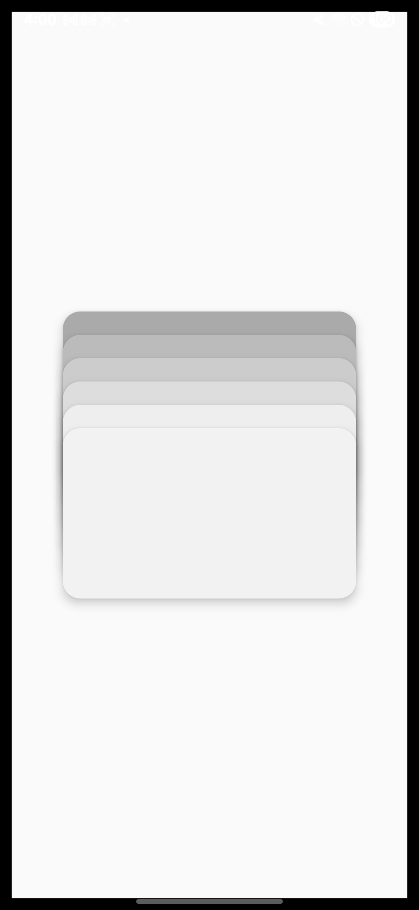 | 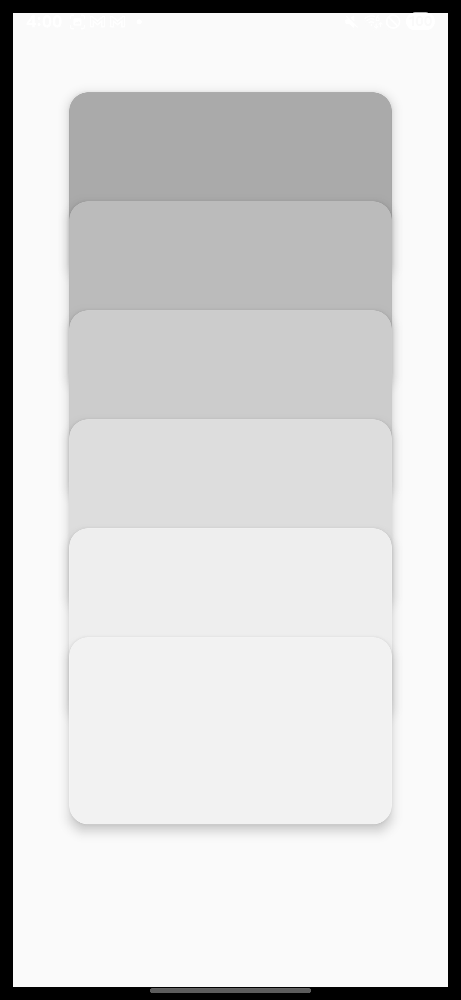 | 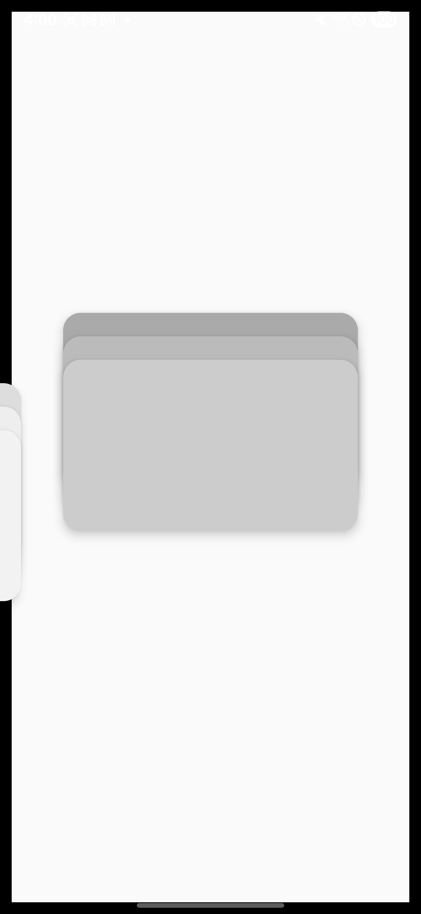 |

### 📝 설명

모바일 결제 앱의 카드 스택 UI를 구현합니다. 여러 개의 카드가 겹쳐진 상태에서 위아래로 드래그하여 펼치거나 접을 수 있고, 좌우로 스와이프하여 카드를 전환할 수 있습니다.

### 🎯 주요 구현 기능

1. **카드 펼치기/접기 (Fold/Unfold)**
   - 아래로 드래그하면 카드가 펼쳐짐
   - 위로 드래그하면 카드가 다시 접힘
   - 펼쳐진 상태에서 약간의 회전 효과

2. **카드 좌우 슬라이더**
   - 왼쪽으로 스와이프하여 다음 카드로 이동
   - 오른쪽으로 스와이프하여 이전 카드로 이동
   - 접힌 상태(fold)에서만 작동

3. **드래그 방향 감지**
   - x축 드래그와 y축 드래그를 구분하여 처리
   - `Math.abs(dx) > Math.abs(dy)`로 방향 판단

### 💻 핵심 코드

#### 1. 카드 데이터 및 애니메이션 값 설정


```tsx
// src/mobilePay/MobilePay.tsx
const MobilePay = () => {
  const cards = [
    { color: '#aaa', xAnim: useRef(new Animated.Value(0)).current },
    { color: '#bbb', xAnim: useRef(new Animated.Value(0)).current },
    { color: '#ccc', xAnim: useRef(new Animated.Value(0)).current },
    { color: '#ddd', xAnim: useRef(new Animated.Value(0)).current },
    { color: '#eee', xAnim: useRef(new Animated.Value(0)).current },
    { color: '#f2f2f2', xAnim: useRef(new Animated.Value(0)).current },
  ];

  const [focus, setFocus] = useState(5); // 현재 포커스된 카드 인덱스
  const yAnim = useRef(new Animated.Value(0)).current; // 카드 펼치기/접기
  const rotateZAnim = useRef(new Animated.Value(0)).current; // 회전 효과
  const cardRef = useRef<string>('fold'); // 'fold' 또는 'unfold'
  // ...
};
```

#### 2. 드래그 방향 감지 및 처리


```tsx
// src/mobilePay/MobilePay.tsx:51-84
const panResponder = PanResponder.create({
  onMoveShouldSetPanResponder: () => true,
  onPanResponderMove: (event, gesture) => {
    const { dy, dx } = gesture;

    // x축 드래그와 y축 드래그 중 어느 쪽이 더 큰지 판단
    const xSlider = Math.abs(dx) > Math.abs(dy);
    const ySlider = Math.abs(dy) > Math.abs(dx);

    // x축 슬라이더: 접힌 상태에서만 작동
    if (xSlider) {
      // 왼쪽으로 일정 이상 스와이프 했을 때
      if (dx < -5 && cardRef.current === 'fold' && 0 <= focus) {
        cards[focus].xAnim.setValue(dx);
      }
    }

    // y축 슬라이더
    if (ySlider) {
      // Fold 상태에서 아래로 드래그: 카드 펼치기
      if (5 < dy && dy < 100 && cardRef.current === 'fold') {
        yAnim.setValue(dy);
      }
      // Unfold 상태에서 아래로 드래그: 회전 효과
      if (5 < dy && dy < 100 && cardRef.current === 'unfold') {
        rotateZAnim.setValue(dy);
      }
      // Unfold 상태에서 위로 드래그: 카드 접기
      if (-75 < dy && dy < 5 && cardRef.current === 'unfold') {
        yAnim.setValue(65 + dy);
      }
    }
  },
  // ...
});
```

#### 3. 드래그 종료 처리

```tsx
// src/mobilePay/MobilePay.tsx:85-146
onPanResponderEnd(e, gestureState) {
  const { dy, dx } = gestureState;
  const xSlider = Math.abs(dx) > Math.abs(dy);
  const ySlider = Math.abs(dy) > Math.abs(dx);

  // x축 슬라이더: 카드 전환
  if (xSlider) {
    // 왼쪽으로 스와이프: 다음 카드로 이동
    if (dx < -5 && cardRef.current === 'fold' && 0 <= focus) {
      Animated.timing(cards[focus].xAnim, {
        toValue: -width * 0.8, // 왼쪽으로 완전히 이동
        duration: 100,
        useNativeDriver: true,
      }).start(finished => {
        if (finished) {
          setFocus(prevFocus => prevFocus - 1); // 포커스 카드 변경
        }
      });
    }

    // 오른쪽으로 스와이프: 이전 카드로 이동
    if (5 < dx && cardRef.current === 'fold' && focus < 5) {
      Animated.timing(cards[focus + 1].xAnim, {
        toValue: 0, // 원래 위치로 복귀
        duration: 100,
        useNativeDriver: true,
      }).start(finished => {
        if (finished) {
          setFocus(prevFocus => prevFocus + 1);
        }
      });
    }
  }

  // y축 슬라이더: 카드 펼치기/접기
  if (ySlider) {
    // 아래로 드래그: Unfold 상태로 전환
    if (5 < dy) {
      Animated.spring(yAnim, {
        toValue: 65, // 펼쳐진 위치
        useNativeDriver: true,
      }).start();
      cardRef.current = 'unfold';

      // Unfold 상태에서 회전 효과 복귀
      if (cardRef.current === 'unfold') {
        Animated.spring(rotateZAnim, {
          toValue: 0,
          useNativeDriver: true,
        }).start();
      }
    }

    // 위로 드래그: Fold 상태로 전환
    if (dy < -5) {
      Animated.spring(yAnim, {
        toValue: 0, // 접힌 위치
        useNativeDriver: true,
      }).start();
      cardRef.current = 'fold';
    }
  }
}
```

#### 4. Animated.multiply를 활용한 카드별 이동 거리 계산

```tsx
// src/mobilePay/MobilePay.tsx:158-180
{cards.map((card, index) => {
  // 중앙 카드를 기준점(0)으로 설정
  const centerIndex = Math.floor(cards.length / 2); // 6개 카드의 경우 3

  // 각 카드의 위치 계산: -3, -2, -1, 0, 1, 2
  const multiplayValue = useRef(
    new Animated.Value(index - centerIndex),
  ).current;

  // yAnim과 곱하여 각 카드의 이동 거리 계산
  // 예: yAnim이 65일 때, index=0인 카드는 -195, index=5인 카드는 130 이동
  const translateY = Animated.multiply(yAnim, multiplayValue);

  return (
    <Animated.View
      key={index}
      style={{
        transform: [
          { translateY: translateY },     // 상하 이동 (펼치기/접기)
          { translateX: card.xAnim },     // 좌우 이동 (슬라이더)
          {
            rotateZ: rotateZAnim.interpolate({
              inputRange: [0, 20],
              outputRange: ['0deg', '2deg'], // 약간의 회전 효과
            }),
          },
        ],
        position: 'absolute',
        backgroundColor: card.color,
        width: width * 0.7,
        height: width * 0.7 * 0.58,
        marginTop: index * 20, // 기본 겹침 효과
        borderRadius: 15,
        // Shadow 효과
        shadowColor: '#000',
        shadowOffset: { width: -3, height: -3 },
        shadowOpacity: 0.2,
        shadowRadius: 10,
        elevation: 5,
      }}
    />
  );
})}
```

### 🎓 학습 포인트

#### 1. Animated.multiply를 활용한 효율적인 애니메이션

하나의 애니메이션 값(`yAnim`)을 여러 카드에 다른 비율로 적용하여 펼침 효과를 구현합니다.

```tsx
// 각 카드마다 다른 이동 거리를 가지도록 설정
const multiplayValue = new Animated.Value(index - centerIndex); // -3, -2, -1, 0, 1, 2
const translateY = Animated.multiply(yAnim, multiplayValue);

// yAnim이 65로 변할 때:
// index 0: translateY = 65 × (-3) = -195 (위로 이동)
// index 3: translateY = 65 × 0 = 0 (정지)
// index 5: translateY = 65 × 2 = 130 (아래로 이동)
```

#### 2. 드래그 방향 감지

x축과 y축 드래그를 구분하여 서로 다른 애니메이션을 적용합니다.

```tsx
const xSlider = Math.abs(dx) > Math.abs(dy); // 가로 방향이 더 크면 true
const ySlider = Math.abs(dy) > Math.abs(dx); // 세로 방향이 더 크면 true

// 조건에 따라 다른 로직 실행
if (xSlider) {
  // 좌우 슬라이더 로직
}
if (ySlider) {
  // 상하 펼치기/접기 로직
}
```

#### 3. 상태 기반 조건부 제스처 처리

카드의 현재 상태(`fold` 또는 `unfold`)에 따라 다른 제스처를 처리합니다.

```tsx
const cardRef = useRef<string>('fold'); // 현재 상태 저장

// Fold 상태에서만 좌우 슬라이더 작동
if (dx < -5 && cardRef.current === 'fold' && 0 <= focus) {
  cards[focus].xAnim.setValue(dx);
}

// Unfold 상태에서만 회전 효과 작동
if (5 < dy && dy < 100 && cardRef.current === 'unfold') {
  rotateZAnim.setValue(dy);
}
```

#### 4. 애니메이션 완료 콜백 활용

애니메이션이 완료된 후 상태를 업데이트하여 순차적인 동작을 보장합니다.

```tsx
Animated.timing(cards[focus].xAnim, {
  toValue: -width * 0.8,
  duration: 100,
  useNativeDriver: true,
}).start(finished => {
  if (finished) {
    setFocus(prevFocus => prevFocus - 1); // 애니메이션 완료 후 포커스 변경
  }
});
```

---

## 📖 참고 자료

- [React Native Animated API 공식 문서](https://reactnative.dev/docs/animated)
- [React Native PanResponder 공식 문서](https://reactnative.dev/docs/panresponder)
- [React Native Easing 함수](https://reactnative.dev/docs/easing)
- [useNativeDriver 사용 가이드](https://reactnative.dev/docs/animations#using-the-native-driver)